# Аттестация 2 по курсу Разработчик Python PRO

Необходимо разработать небольшую консольную программу на Python, которая управляет списком задач (tasks)
Программа должна использовать базовые алгоритмы для работы с задачами, асинхронное программирование для выполнения задач в параллельных потокахи паттерны пректирования для улучшения структцры кода.

# Задание:
## 1. Алгоритмы
- Реализуйте алгоритм сортировки задач по времени создания (используйте сортировку пузырьком или сортировку выбором)
- Реализуйте поиск задачи по ее идентификатору (например линейный поиск).

## 2. Асинхронное программирование:
- Используйте библиотеку asyncio для асинхронного выполнения задач
- Каждая задача должна выполняться асинхронно (например с задержкой в несколько секунд для имитации длительных операций).
- Должна быть возможность запустить неколько задач параллельно

## 3. Паттерны проектирования:
- Используйте паттерн "Команда" для инкапсуляции каждой задачи в виде отдельного объекта с функцией выполнения.
- Примените паттерн "Одиночка" для управления глобальной очередью задач, где хранятся все задачи.

## 4. Основные функции программы:
- Добавление новой задачи в список.
- Удаление задачи по ее идентификатору.
- Запуск всех задач (асинхронно).
- Просмотр списка задач.
- Поиск задачи по идентификатору.

## 5. Описание интерфейса программы:
- Добавление задачи: Пользователь вводит описание задачи, и она добавляется в список задач с уникальным идентификатором и временем создания.
- Удаление задачи по ID. Пользователь вводит идентификатор задачи и она удаляется из списка.
- Запуск задач: Программа запускает все задачи из списка асинхронно (с задержкой в несколько секунд для каждой задачи).
- Просмотр списка задач: выводится весь список задач, отсортированных по времени их добавления.
- Поиск по ID: программа находи задачу по идентификатору и выводит ее описание.

## Обновленное задание
### Задание: 
Система управления задачами с использованием ООП, PostgreSQL и асинхронного программирования
### Цель: 
Разработать консольное приложение на Python для управления задачами с использованием:

1. Объектно-ориентированного подхода
2. PostgreSQL для хранения данных
3. Асинхронного выполнения задач
4. Паттернов проектирования
5. Системы контроля версий (Git/GitHub)

## Решение
### Работа с Базой данных
- Создана база данных для хранения списка задач в файле tasks.py
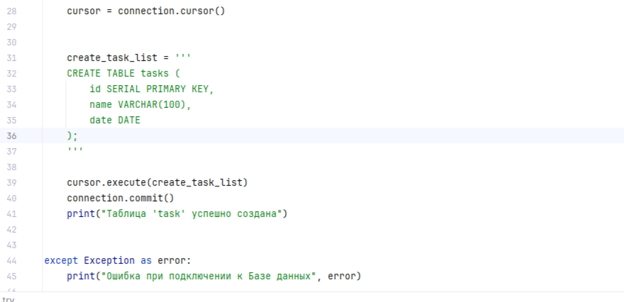
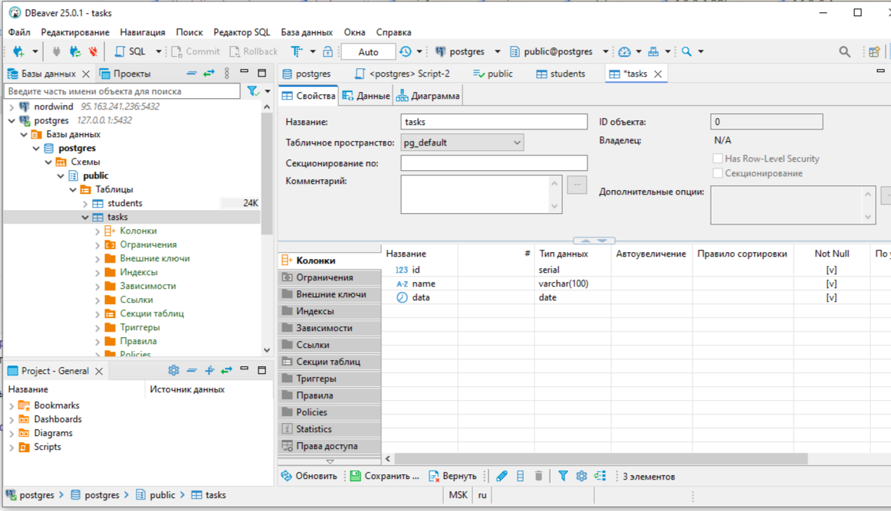
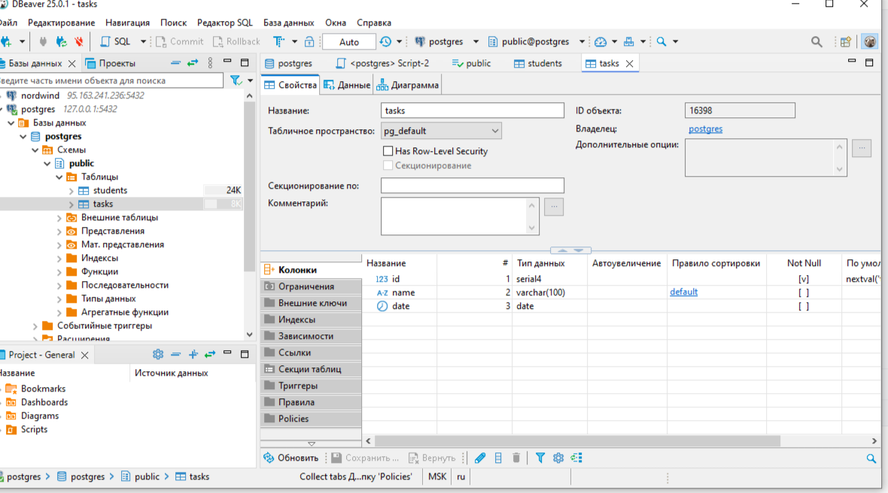
- Добавлена часть задач в таблицу
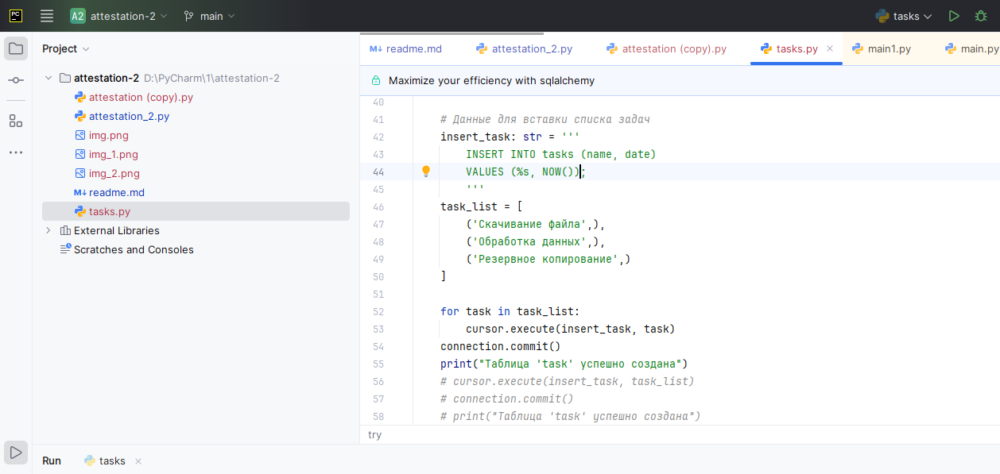

- Добавлена вторая часть задач
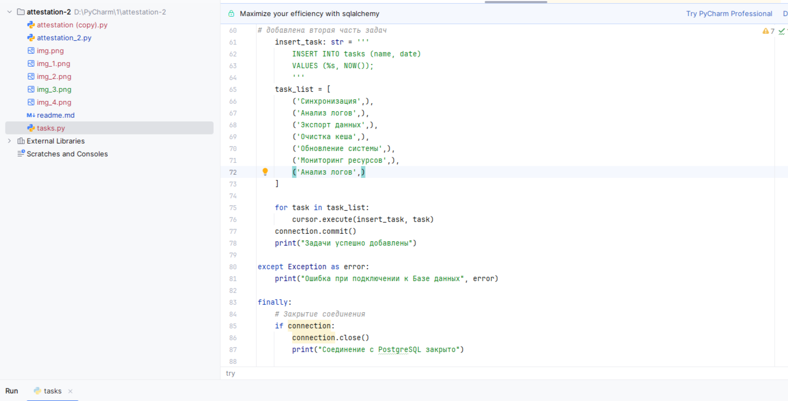
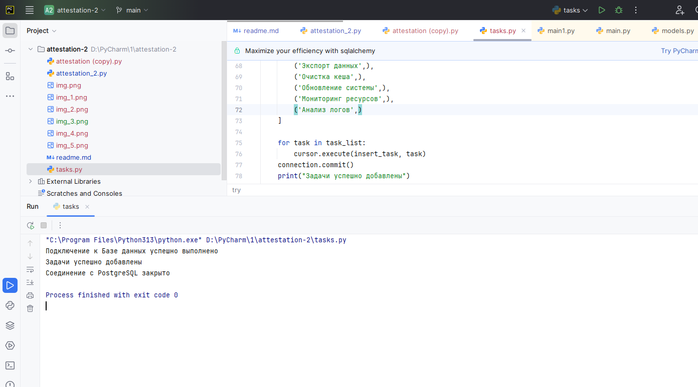
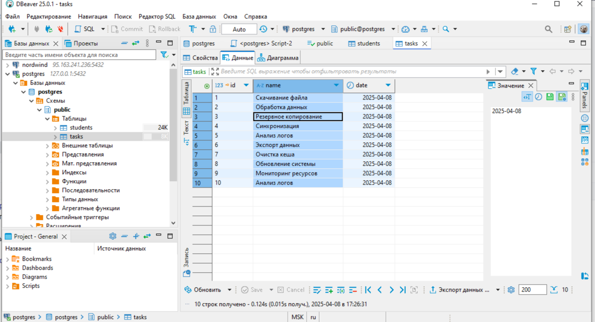

### Работа с классами и функциями
- Создание списка задач
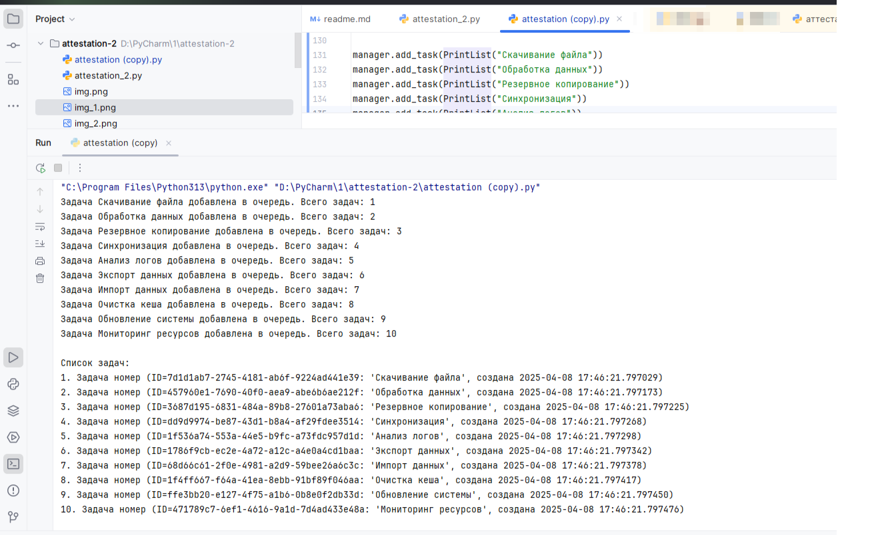
- Вывод списка и выгрузка списка в файл 
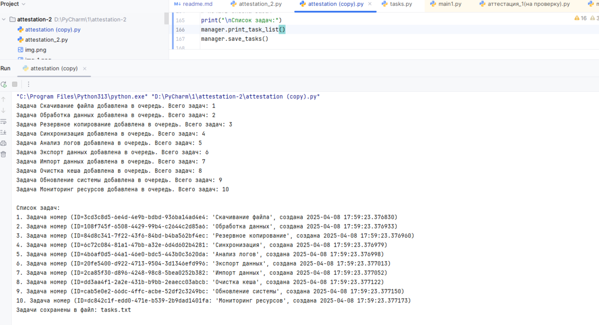, 
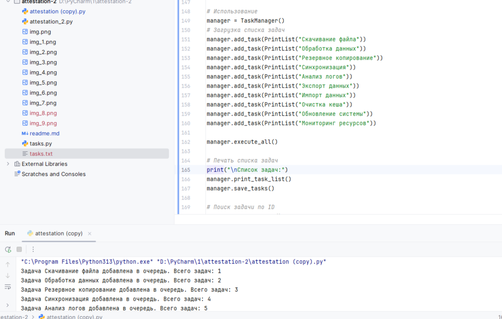
- Поиск задачи по ID
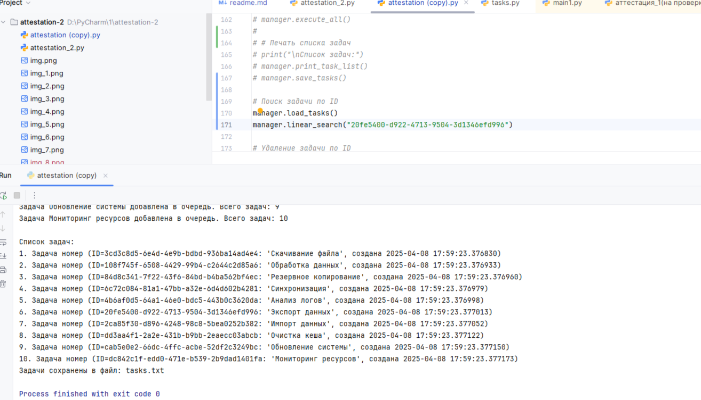
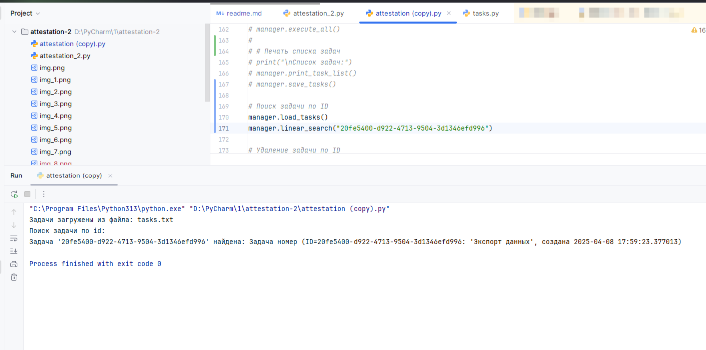

- Удаление задачи по ID
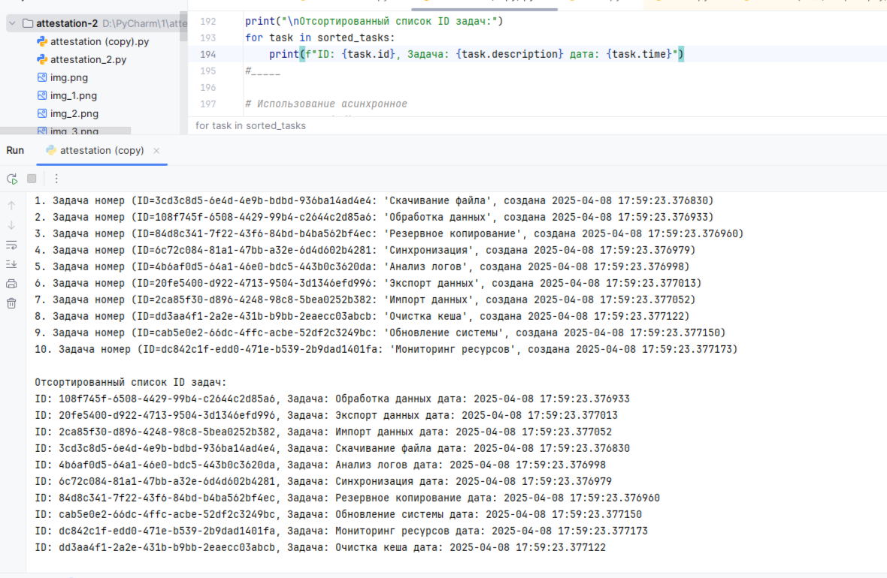
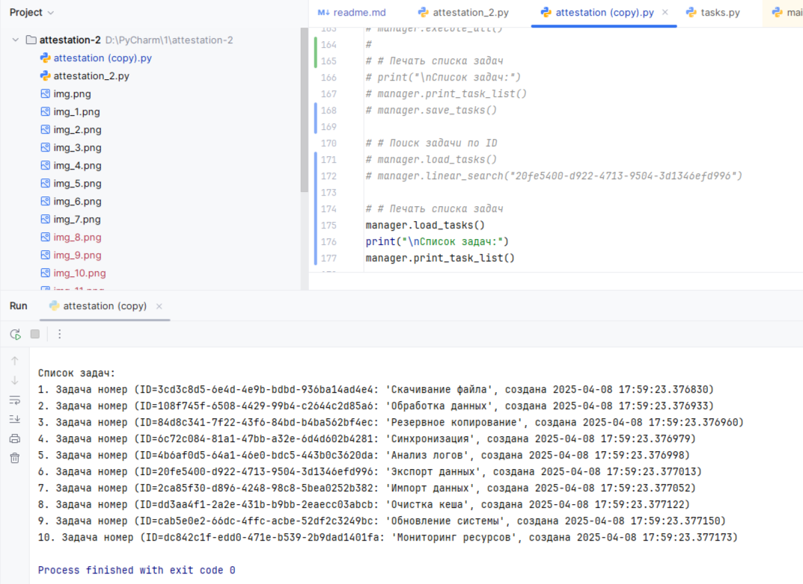
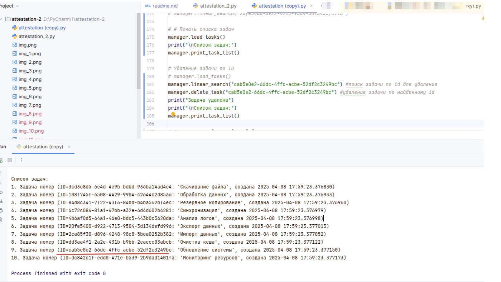
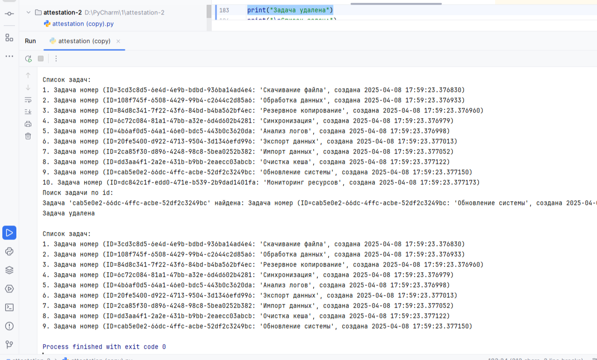
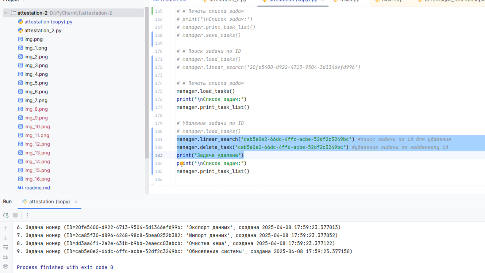
- Пузырьковая сортировка
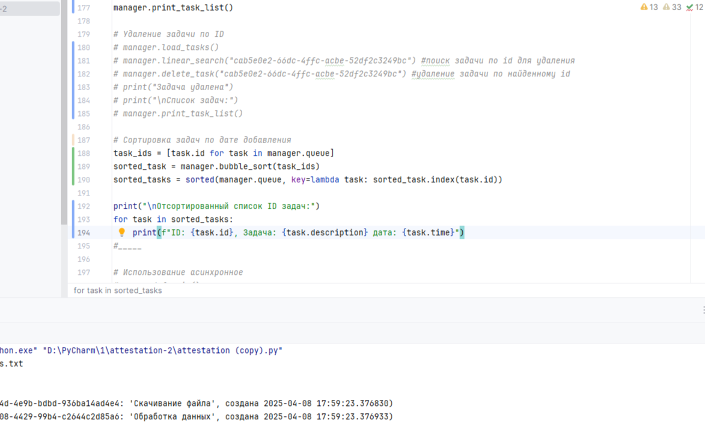
ПС. Знаю, что в задании необходимо было сделать сортироваку по дате добавления, но список итак был отсортирован по дате добавления и в таком случае не было бы видно результата работы алгоритма сортировки. Поэтому был выбран id для таргета в сортировке.
Требования к архитектуре (ООП):
class Task:
    """Класс задачи с свойствами: id, description, created_at, status"""
    
class TaskManager:
    """Основной класс для управления задачами (CRUD операции)"""
    
class PostgreSQLConnector:
    """Класс для работы с PostgreSQL (подключение, запросы)"""
    
class AsyncTaskExecutor:
    """Класс для асинхронного выполнения задач"""

Работа с PostgreSQL
Использовать библиотеку asyncpg для асинхронного взаимодействия или psycopg2

Паттерны проектирования
1. Repository - для абстракции работы с БД
2. Command - для инкапсуляции операций с задачами
3. Singleton - для управления подключением к БД
4. Observer - для уведомлений об изменении статуса задач

Асинхронное выполнение
1. Использовать asyncio для параллельного выполнения
2. Реализовать пул задач с ограничением одновременного выполнения

Алгоритмы
1. Сортировка задач по дате создания (merge sort)
2. Бинарный поиск по ID (для отсортированного списка)

GitHub
Вести поэтапную разработку проекта, не нужно все сохранять в один коммит.

